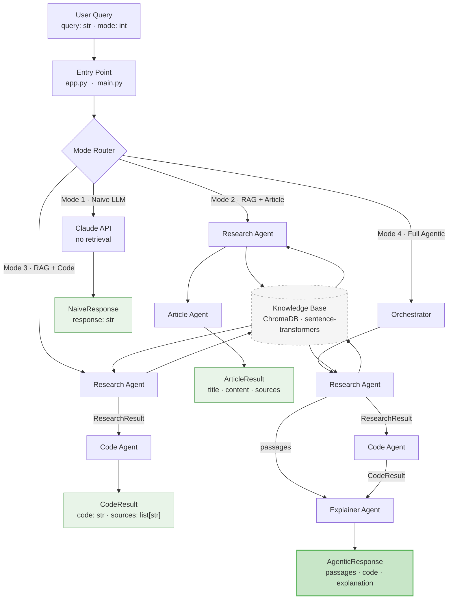

# AlgoAssist — Architecture Diagram

## Mode Progression

| Mode | Agents Active | Output |
|------|--------------|--------|
| 0 — Standard IDE | *(conceptual baseline, not in app)* | — |
| 1 — Naive LLM | Claude API only | Raw LLM response |
| 2 — RAG + Article | Research Agent → Article Agent | GeeksforGeeks-style article with code, complexity, examples |
| 3 — RAG + Code | Research Agent → Code Agent | Grounded code + source citations |
| 4 — Full Agentic | Orchestrator → Research → Code → Explainer | Code + plain-language explanation |
